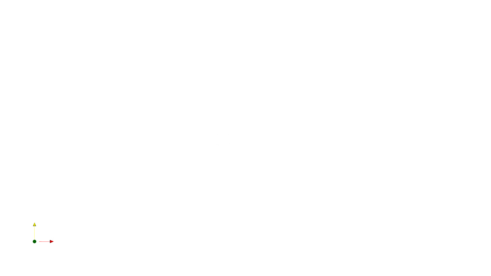
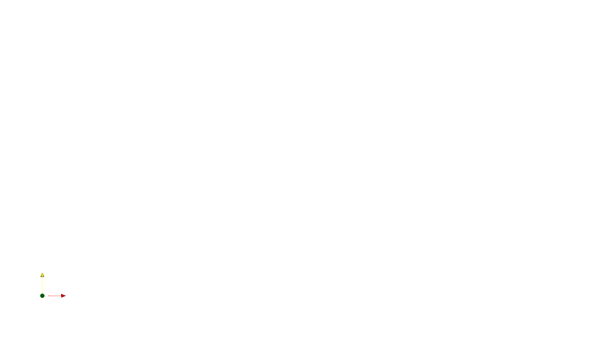

# RustyMesher 🦀🕸️

**Elliptic and Parabolic O-Grid Generation for Airfoils**


## About

**RustyMesher** is a numerical tool written in Rust designed to generate structured 2D computational meshes (O-grids) around an airfoil. This project was developed for educational purposes as part of the **CC-297 (Fundamentals of Computational Fluid Dynamics)** postgraduate course at **ITA** (Instituto Tecnológico de Aeronáutica). 

The goal of this project is to implement and compare different numerical schemes for grid generation based on partial differential equations (PDEs), specifically Elliptic and Parabolic methods, providing a solid foundation for future CFD simulations.

## Results & Visualizations

<div align="center">
  <table>
    <tr>
      <td></td>
      <td></td>
    </tr>
    <tr>
      <td align="center"><b>O-Grid Laplace Mesh</b></td>
      <td align="center"><b>NACA0012 Airfoil</b></td>
    </tr>
  </table>
</div>


## Key Features

* **Parabolic Grid Generation:** Utilizes a fast, marching algorithm starting from the inner boundary (airfoil) towards the outer boundary, applying a Laplacian smoothing approach (following Nakamura).
* **Elliptic Grid Generation:** Solves Laplace or Poisson's equations using the **Alternating Direction Implicit (ADI) / AF1** approximate factorization scheme. For Poisson method, incorporates source terms ($P$ and $Q$) at the boundaries to enforce orthogonality and precise cell spacing (following Sorenson and Steger).
* **Structured O-Grid Topology:** Maps the physical domain ($x, y$) to a rectangular computational domain ($\\xi, \\eta$).
* **Biconvex or NACA00XX Airfoil Geometry:** Analytically generates the inner boundary geometry for the selected airfoil.
* **Export to VTK:** The mesh file output is .CSV - for easy verification - and .VTK - for compatibility with [ParaView](https://github.com/Kitware/ParaView).

## Project Structure

* `src/main.rs`: Entry point of the application.
* `src/config.rs`: TOML parser for simulation parameters.
* `src/geometry.rs`: Biconvex airfoil coordinate generation.
* `src/mesher_core.rs`: Base data structures and domain definitions.
* `src/elliptic_mesher.rs`: Implementation of the Poisson solver via ADI/AF1 scheme.
* `src/parabolic_mesher.rs`: Implementation of the parabolic marching scheme.
* `src/mesher_utils.rs`: Helper functions, tridiagnoal system solvers and I/O handlers.
* `postproc/`: Python scripts for grid visualization.

## Getting Started

### Prerequisites

1.  **Rust Toolchain:** Install [Rust and Cargo](https://rustup.rs/).
2.  **Python 3 (optional):** For post-processing and plotting.


```bash
    pip install pandas matplotlib
```

### Running the Mesher

1.  Clone the repository:
    ```bash
    git clone [https://github.com/IanViotti/RustyMesher.git](https://github.com/IanViotti/RustyMesher.git)
    cd RustyMesher
    ```

2.  Adjust parameters (nodes, thickness, relaxation factors) in the configuration file (e.g., `job_config.toml`) - Note: the job_config.toml should always be on the same directory as the working directory of the executable.

3.  Build and run the project in release mode for optimal performance:
    ```bash
    cargo run --release
    ```
    *The generated grid coordinates will be saved as CSV and vtk files in the `job_files/` directory.*

### Visualization

It is recomended that the user uses [ParaView](https://github.com/Kitware/ParaView) for mesh visualization. The .VTK file output can be easily imported on Paraview.

For a fast and easy inspection, use the provided Python script to plot the mesh using matplotlib.

## References

This code implements mathematical methods heavily based on the following classical CFD literature:

1. **Uller, M., e Azevedo, J.L.F.** (1991). *Grid Generation Technique Effects on Transonic Full Potential Solutions of Airfoil Flows* 
2.  **Thompson, J. F., Thames, F. C., and Mastin, C. W.** (1974). *Automatic Numerical Generation of Body-Fitted Curvilinear Coordinate System for Field Containing Any Number of Arbitrary Two-Dimensional Bodies*. Journal of Computational Physics.
3.  **Sorenson, R. L., and Steger, J. L.** (1977). *Numerical Generation of Two-Dimensional Grids by the Use of Poisson Equations with Grid Control at Boundaries*.
4.  **Nakamura, S.** (1982). *Marching Grid Generation Using Parabolic Partial Differential Equations*. Numerical Grid Generation.
5.  **Ballhaus, W. F.** *Implicit Approximate-Factorization Scheme for the Efficient Solution of Steady State Transonic Flow Problems.*.

## License

This project is intended for **educational purposes** only. 

---
*Developed as an assignment for CC-297.*
